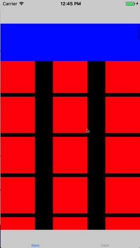

[](LICENSE)
[](https://github.com/Carthage/Carthage)
[](https://img.shields.io/cocoapods/v/StickyHeader.svg)
[](http://cocoadocs.org/docsets/StickyHeader)

# StickyHeader

Simple library based on work done on [MXParallaxHeader](https://github.com/maxep/MXParallaxHeader) helping to 
create a sticky header for an UIScrollView.



## Installation

### CocoaPods

```
pod "StickyHeader"
```

### Carthage
```
github "yageek/StickyHeader"
```

## Usage

To add a sticky header:

```swift

// Create the header
let view = UIView(frame: CGRect(x: 0, y: 0, width: 0, height: 100))
view.backgroundColor = UIColor.blueColor()
view.translatesAutoresizingMaskIntoConstraints = false

// Add the header to the table view
self.tableView.stickyHeader.view = self.headerView
self.tableView.stickyHeader.height = 200
self.tableView.stickyHeader.minimumHeight = 100
```

## Changelog
 - 2.0.0: Swift 3. compatible.
 - 1.0.1: Swift 2.3 compatible.
 - 1.0.0: First release.
 
## License

StickyHeader is released under the MIT license. See LICENSE for details.
